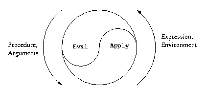

[](https://travis-ci.org/zjhmale/metace)

# metace

* eval -> get value of symbols and buildins
* apply -> execute complicate expression
* eval will use apply and apply will use eval -> just like a meta circular

meta circular evaluator in clojure



## run

```
lein run
lein run -f test.scm
```

## test

```
lein test
```
